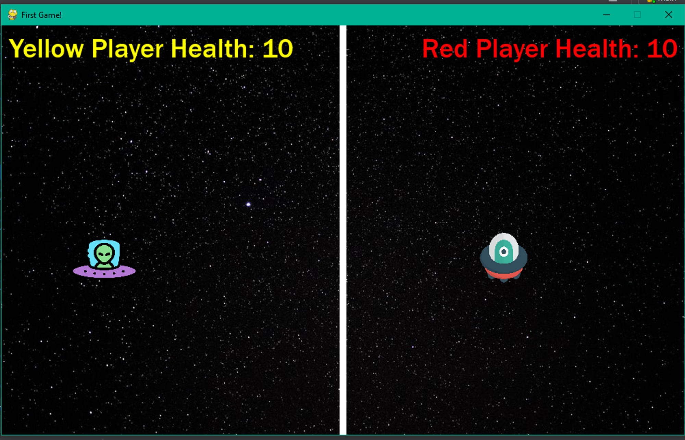

# spaceship game using pygame

a simple shooting game project using pygame module

.png>)
.png>)

left Ctrl key - for left spaceship's(yellow spaceship) hitting bullet
right Ctrl key - for right spaceship's(red spaceship) hitting bullet

a, s, d, w -- for moving the left (yellow) spaceship
up, down, left, right arrow key - for moving the right (red) spaceship
